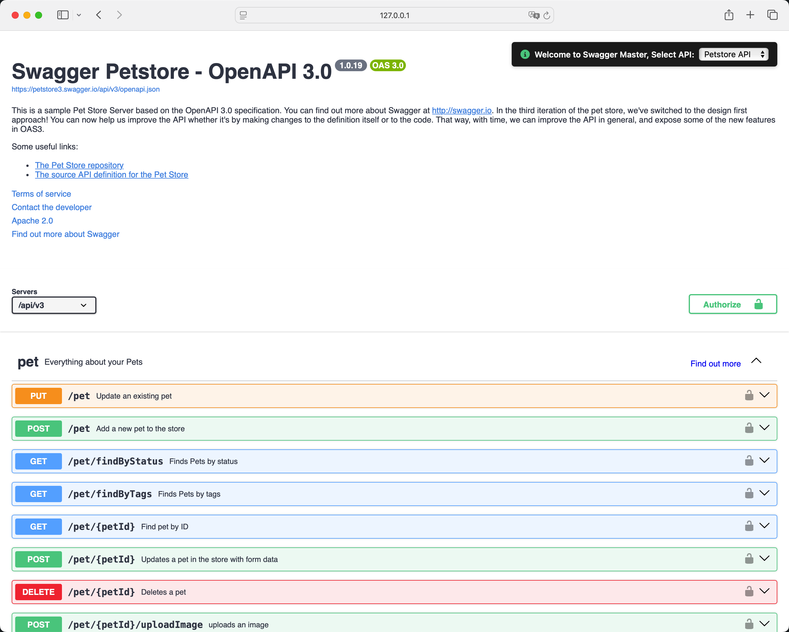

# Swagger Master

<p align="right">
  <a href="README.zh-CN.md">中文文档</a>
</p>

<p align="center">
  
  <br>
  <i>A lightweight, single-file Swagger UI manager for multiple OpenAPI specifications</i>
  <br>
</p>

<p align="center">
  <a href="#features">Features</a> •
  <a href="#screenshot">Screenshot</a> •
  <a href="#demo">Demo</a> •
  <a href="#quick-start">Quick Start</a> •
  <a href="#customization">Customization</a> •
  <a href="#contributing">Contributing</a> •
  <a href="#license">License</a> •
  <a href="#acknowledgments">Acknowledgments</a>
</p>

<p align="center">
  <a href="https://github.com/tobyqin/swagger-master/blob/main/LICENSE">
    
  </a>
  <a href="https://github.com/tobyqin/swagger-master/stargazers">
    
  </a>
  <a href="https://github.com/tobyqin/swagger-master/network/members">
    
  </a>
</p>

<p align="center">
  ⭐️ If you find this project useful, please consider giving it a star to show your support! ⭐️
</p>

## Features

- 📦 **Single File** - No build process, no dependencies to install
- 🔄 **Multiple API Support** - Switch between different OpenAPI specifications seamlessly
- 🚀 **Easy Deployment** - Host anywhere as a static file
- ⚡ **Fast Loading** - Uses CDN for all external resources
- 🎨 **Clean UI** - Intuitive interface with API selector
- 🔧 **Easy Configuration** - Simple API list customization

## Screenshot

<p align="center">
  
  <br>
  <i>Swagger Master in action - managing multiple API specifications</i>
</p>

## Demo

Visit our [live demo](https://tobyqin.github.io/swagger-master) to see Swagger Master in action.

## Quick Start

1. Download the `index.html` file
2. Add your API list to the `API_LIST` array in the `index.html` file
3. Open the `index.html` file in your browser to test it out
4. Host anywhere as a static file

## Customization

### Styling

The UI is customizable through the CSS section in the `index.html` file. Key style classes:

- `#api-selector` - The API selection dropdown container
- `#swagger-ui` - The main Swagger UI container
- `.info-icon` - The information icon styling

### Configuration Options

The API list is configured in the `index.html` file. The `API_LIST` array contains the API specifications. Each API specification is an object with the following properties:

```javascript
const API_LIST = [
  {
    name: "Petstore API",
    url: "https://petstore3.swagger.io/api/v3/openapi.json",
    description:
      "This is the Swagger Petstore API, a sample API that demonstrates OpenAPI specification features.",
    maintainer: {
      name: "Swagger Team",
      email: "swagger@example.com",
    },
  },
  // Add more APIs as needed
];
```

Each API configuration supports:

- `name`: Display name for the API
- `url`: URL to the OpenAPI specification JSON/YAML
- `description`: A detailed description of the API's purpose and features
- `maintainer`: Contact information for the API maintainer
  - `name`: Maintainer's name
  - `email`: Maintainer's email address

The description and maintainer information can be viewed by clicking the info icon (i) next to the API selector.

## FAQ

### How to fix CORS (Cross-Origin Resource Sharing) errors?

If you see errors like "Failed to load API definition" or "Possible cross-origin (CORS) issue", you can try one of these solutions:

1. **Configure Backend Server** (Recommended for Production)

   - Configure your API server to allow CORS requests by adding appropriate headers:

   ```
   Access-Control-Allow-Origin: *  # Or your Swagger Master domain
   Access-Control-Allow-Methods: GET, POST, PUT, DELETE, OPTIONS
   Access-Control-Allow-Headers: *
   ```

   - This is the most secure and recommended solution for production environments

2. **Use a Proxy Server** (Alternative for Production)

   - Set up a proxy server (e.g., Nginx) to forward requests and add CORS headers
   - Example Nginx configuration:

   ```nginx
   location /api/ {
       proxy_pass http://your-api-server/;
       add_header 'Access-Control-Allow-Origin' '*';
       add_header 'Access-Control-Allow-Methods' 'GET, POST, PUT, DELETE, OPTIONS';
       add_header 'Access-Control-Allow-Headers' '*';
   }
   ```

3. **Use Browser Extensions** (Development Only)
   - Install CORS-disabling browser extensions (e.g., "CORS Unblock" for Chrome)
   - ⚠️ Warning: Only use this method for development/testing
   - Disable the extension when not needed for security reasons

## Contributing

Contributions are welcome! Please feel free to submit a Pull Request. For major changes, please open an issue first to discuss what you would like to change.

1. Fork the Project
2. Create your Feature Branch (`git checkout -b feature/AmazingFeature`)
3. Commit your Changes (`git commit -m 'Add some AmazingFeature'`)
4. Push to the Branch (`git push origin feature/AmazingFeature`)
5. Open a Pull Request

## License

This project is licensed under the MIT License - see the [LICENSE](LICENSE) file for details.

## Acknowledgments

- [Swagger UI](https://github.com/swagger-api/swagger-ui) for the amazing API documentation tool
- [Font Awesome](https://fontawesome.com) for the icons

---

<p align="center">
  Made with ❤️ by <a href="https://github.com/tobyqin">Toby Qin</a>
</p>
